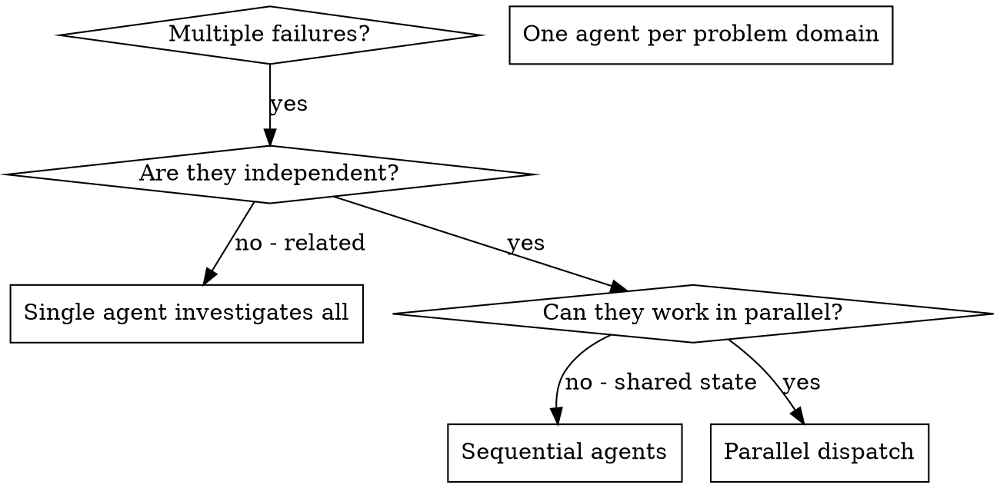

# Parallel Subagent Dispatch

## When to Use Parallel Dispatch



**Use when:**
- 3+ test files failing with different root causes
- Multiple subsystems broken independently
- Each problem can be understood without context from others
- No shared state between investigations

**Don't use when:**
- Failures are related (fixing one might fix others)
- Need to understand full system state
- Agents would interfere with each other (editing same files, using shared resources)

---

## Agent Prompt Structure

Good agent prompts are:
1. **Focused** - One clear problem domain
2. **Self-contained** - All context needed to understand the problem
3. **Specific about output** - What should the agent return?

### Prompt Template

```markdown
Fix the <N> failing tests in <test-file-path>:

1. "<test name 1>" - <brief failure description>
2. "<test name 2>" - <brief failure description>

These are <issue type, e.g. timing/race condition> issues. Your task:

1. Read the test file and understand what each test verifies
2. Identify root cause - timing issues or actual bugs?
3. Fix by:
   - <Specific remediation approach 1>
   - <Specific remediation approach 2>
   - Adjusting test expectations if testing changed behavior

Constraints:
- Do NOT just increase timeouts - find the real issue.
- Do NOT modify unrelated production code.

Return: Summary of what you found and what you fixed.
```

### Common Mistakes

- **❌ Too broad:** "Fix all the tests" — agent gets lost
- **✅ Specific:** "Fix agent-tool-abort.test.ts" — focused scope
- **❌ No context:** "Fix the race condition" — agent doesn't know where
- **✅ Context:** Paste the error messages and test names
- **❌ No constraints:** Agent might refactor everything
- **✅ Constraints:** "Do NOT change production code" or "Fix tests only"
- **❌ Vague output:** "Fix it" — you don't know what changed
- **✅ Specific:** "Return summary of root cause and changes"
