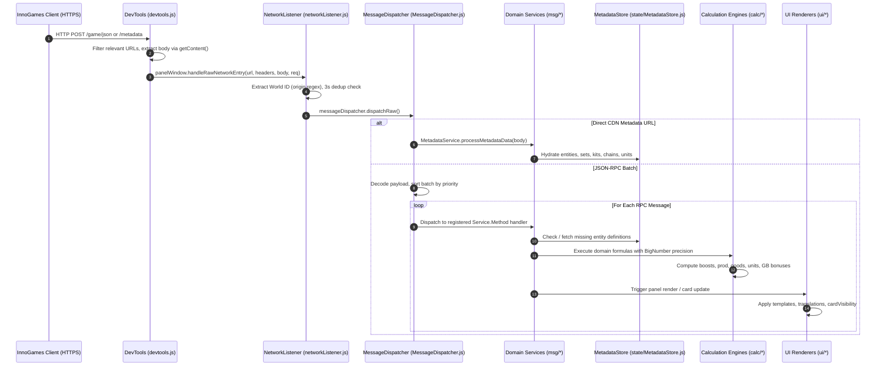

# FoE-Info Extension Architecture & Knowledge Base

**Last Updated**: 2026-09-12  
**Knowledge Engine**: Graphify Multi-Graph Architecture (`graphify-foe-info` + `graphify-metadata-store`)  
**AST Topology**: 3,047 Nodes · 4,975 Edges · 248 Communities  
**Metadata Store**: 5,499 Nodes · 46,623 Edges · 383 Communities  
**Reflected Memories**: 26 Verified Architectural Signals

---

## 1. System Overview

FoE-Info is an agentic Chrome Manifest V3 browser extension for _Forge of Empires_. It provides real-time economic, combat, guild, and city intelligence inside the browser's native DevTools panel by passively intercepting InnoGames JSON-RPC network payloads.

```text
FoE-Info-Extension/
├── src/
│   ├── chrome/              # MV3 entry points (devtools.html, panel.html, options.html)
│   ├── css/                 # Bootstrap 5.3 theme and component stylesheets
│   ├── i18n/                # 7-language dictionaries (de, el, en, es, fr, gr, it)
│   └── js/
│       ├── calc/            # Pure calculation engines (BigNumber math, zero DOM)
│       ├── msg/             # InnoGames JSON-RPC service handlers (14+ domain services)
│       ├── protocol/        # Interception, deduplication, priority dispatching
│       ├── state/           # In-memory reactive state & dynamic MetadataStore
│       ├── ui/              # Container binding, Bootstrap cards, renderers
│       └── utils/           # Storage isolation, i18n resolver, XSS formatters, logger
├── tests/                   # Native Node.js test suites (1,002 tests, 97 suites)
└── graphify-out/            # Knowledge graphs, wiki, and visual exports
```

---

## 2. End-to-End Data Lifecycle

Data moves through 6 decoupled stages from raw network packet to DOM presentation:



### Stage Details

1. **Network Interception (`devtools.js`)**:
   - Uses `browser.devtools.network.onRequestFinished`.
   - Buffers up to 500 requests (`pendingEntries`) until the panel finishes mounting.
   - Forwards directly to `panelWindow.handleRawNetworkEntry`.
2. **Protocol Routing & Deduplication (`networkListener.js`)**:
   - Extracts world ID via regex: `https://([a-z0-9]+)\.forgeofempires\.com`.
   - Updates `worldStorage` active world scope.
   - Runs a 3,000ms rolling hash deduplication check on `(url + body.length + 100-char sample)`.
3. **Priority Dispatching (`MessageDispatcher.js`)**:
   - Decodes base64 or JSON payloads.
   - Sorts JSON-RPC arrays by registration priority: System hydration services (`StartupService` = 100, `MetadataService` = 90) execute before secondary domain services (priority 0).
   - Isolates handler failures using `try/catch` boundaries.
4. **Dynamic Metadata & State Hydration (`msg/` & `state/`)**:
   - Zero static game JSON files exist in `src/`.
   - `MetadataStore.js` dynamically ingests definitions and maintains O(1) relational indexes (`entityToUpgrade`, `entityToKits`, `entityToSet`, `entityToChain`).
   - If an uncataloged building appears in a player's city, `StartupService.js` and `MetadataService.js` stream raw definitions from InnoGames CDN before lifting the startup barrier.
5. **Calculation Engines (`calc/`)**:
   - All intermediate calculations use `bignumber.js` (v11.1.5) via `bignumberUtils.toBigNumber()`.
   - Hybrid rounding: Half-up (`ROUND_HALF_UP`) for investor Arc boost rewards; ceiling (`ROUND_CEIL`) for owner safe-spot locks.
6. **UI Rendering & Card Visibility (`ui/`)**:
   - `containerBinding.js` mounts containers into `panel.html`.
   - `cardVisibility.js` applies declarative 6-context matrix (`City`, `VisitedCity`, `QuantumIncursions`, `GuildBattlegrounds`, `GuildExpedition`, `Settlement`).
   - `formatters.js` escapes all HTML before DOM injection to prevent XSS.

---

## 3. Top Architectural God Nodes & Hubs

| Hub Node                  | Degrees / Edges | File Location                          | Responsibility                                     |
| :------------------------ | :-------------: | :------------------------------------- | :------------------------------------------------- |
| `createLogger()`          |       61        | `src/js/utils/logger.js`               | Gated diagnostic logging interface                 |
| `MetadataStore`           |       53        | `src/js/state/MetadataStore.js`        | Central reactive entity and upgrade registry       |
| `scripts`                 |       51        | `package.json`                         | Verification, build, and graph runners             |
| `MessageDispatcher`       |       40        | `src/js/protocol/MessageDispatcher.js` | Declarative JSON-RPC router with priority queues   |
| `setupIndexBridge()`      |       39        | `src/js/protocol/indexBridgeSetup.js`  | Service wire-up orchestrator replacing index.js    |
| `startupService()`        |       34        | `src/js/msg/StartupService.js`         | Player session, city topology, and boost hydration |
| `MetadataStore` (methods) |       33        | `src/js/state/MetadataStore.js`        | Relational kit, set, and chain indexers            |

---

## 4. Subsystem Catalog

### 4.1 Protocol & Network Layer

- `src/js/devtools.js`: DevTools network listener and panel bridge.
- `src/js/protocol/networkListener.js`: World ID extraction and 3s deduplication.
- `src/js/protocol/MessageDispatcher.js`: Priority sorting and error-isolated RPC dispatching.
- `src/js/protocol/indexBridgeSetup.js`: Modular service registration and bridge initialization.
- `src/js/protocol/legacyBridge.js`: Legacy action routing partitioned into:
  - `protocol/routes/cityRoutes.js`: City collections, production, and map queries.
  - `protocol/routes/buildingRoutes.js`: Building construction, demolition, and upgrades.
  - `protocol/routes/socialRoutes.js`: Friends, neighbors, and clan members.
  - `protocol/routes/combatRoutes.js`: Battle results, defense armies, and PvP.
  - `protocol/routes/quantumRoutes.js`: Quantum Incursions endpoints wrapped with `withQiContext`.

### 4.2 Calculation Engines (`src/js/calc/`)

- `CityStatsCalculator.js`: Main city production and military boost orchestrator.
- `VisitedCityStatsCalculator.js`: Isolated topology calculation for scouted cities.
- `BlueGalaxyCalculator.js`: Economic harvest ranking for Blue Galaxy charges.
- `GreatBuildingCalculator.js`: Leveling curves, Arc boost bonuses, and spot locks.
- `InvestedCalculator.js`: Neighborhood snipe profit margins and player investments.
- `boosts/MilitaryBoostCalculator.js`: Red vs. Blue Attack/Defense percentage tallies.
- `goods/GoodsCalculator.js`: Era-specific, unrefined feeder, and treasury goods.
- `prod/ProductionCalculator.js`: Coins, Supplies, and FP with Great Building multipliers.
- `units/UnitCalculator.js`: Daily Alcatraz military unit generation by era.
- `utils/spatialUtils.js`: Set building adjacency and chain building link evaluation.
- `utils/bignumberUtils.js`: Arbitrary-precision math helpers.

### 4.3 Domain RPC Services (`src/js/msg/`)

- `StartupService.js`: Account, era, resources, and city layout initialization.
- `GuildRaidsService.js`: Quantum Incursions actions, member activity diffs, and leaderboards.
- `GreatBuildingsService.js`: Great Buildings data parsing and investment tracking.
- `CityProductionService.js`: Production collection events and Frontenac/Saint Mark's boosts.
- `InventoryService.js`: Inventory items, selection kits, and fragment thresholds.
- `AllyService.js`: Historical Allies room assignments and rarity scaling.
- `BoostService.js`: Tavern and inventory temporary combat boosts.
- `CastleSystemService.js`: Castle system permanent rewards and daily chests.
- `ResourceService.js`: Live tracking of FP, Coins, Supplies, and Special Goods.
- `TradeService.js`: Marketplace trade offers and era fair-trade valuation.
- `GuildBattlegroundService.js`: GBG attrition curves, sector timers, and siege camp costs.
- `GuildExpeditionService.js`: GE encounter trials, negotiation stages, and championship stats.
- `MetadataService.js`: CDN entity payload ingestion and on-demand resolution.

### 4.4 State & Storage Architecture (`src/js/state/` & `src/js/utils/`)

- `MetadataStore.js`: Reactive entity graph and relational indexes.
- `BlueGalaxyState.js`: Event-driven state model for Blue Galaxy charges.
- `showOptions.js`: Feature visibility toggles.
- `worldStorage.js`: Per-world key-prefixed storage with default hydration.
- `factoryDefaults.js`: Baseline settings configuration.
- `indexEntityDefs.js` & `entityDefsCache.js`: Entity definitions caching and storage sync.

### 4.5 UI & Renderers (`src/js/ui/`)

- `containerBinding.js`: Dynamic DOM container mounting in `panel.html`.
- `indexUiBindings.js`: DevTools panel lifecycle and UI event binding.
- `cardVisibility.js`: Declarative 6-context card visibility engine.
- `optionsForm.js`: Settings UI serialization and deserialization.
- `renderLiveCityStats.js`: Primary city statistics panel renderer.
- `renderQuantumPanels.js`: Quantum Incursions contributions and leaderboard cards.
- `renderGbDonationPanel.js`: Great Buildings donation and snipe cards.
- `renderBattlegroundsPanel.js`: Guild Battlegrounds map and attrition panel.
- `renderExpeditionPanel.js`: Guild Expedition trials and championship panel.
- `renderGuildPanel.js`: Guild overview and member activity tables.
- `renderAlliesPanel.js`: Historical Allies assignments and room yields.
- `renderGalaxyPanel.js`: Blue Galaxy harvest priority list.

---

## 5. Corroborated Invariants

1. **Modular Architecture ($\le 600$ lines/file)**:
   - `index.js` decomposed from 2,806 lines to 165 lines.
   - 99.4% of files comply with the budget.
2. **BigNumber Precision Math**:
   - Zero native JavaScript floating-point drift in FP calculations or boost tallies.
   - Strict half-up rounding for rewards; strict ceiling rounding for position locks.
3. **Zero Static Game Metadata**:
   - Zero static entity JSON files in `src/`. All entity intelligence streams dynamically from InnoGames CDN.
4. **Strict Passive Observation**:
   - No automated botting, injected script execution, or active game state modification.
   - Zero autonomous browser control; passive DevTools network listener only.
