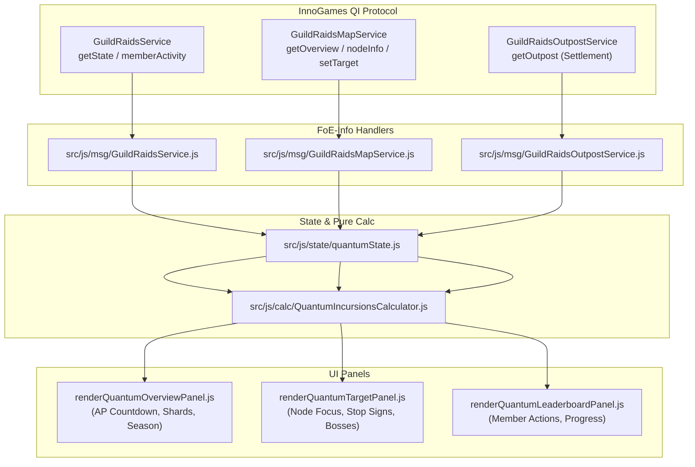

# Plan: Comprehensive Live HAR Ingestion, Multi-Domain Verification & QI Architecture

**Date**: 2026-09-12  
**Harness**: OpenCode Execution Task  
**Delegation Target**: OpenCode Multi-Domain Squad  
**Status**: Executed — Phase 1 & 2 complete; Phase 3 architecture complete (implementation pending). See the [execution record](#6-execution-record-2026-09-12) and [`2026-09-12-quantum-incursions-architecture.md`](2026-09-12-quantum-incursions-architecture.md).  
**Safety Invariant**: `docs/har/*.har` must **NEVER** be committed to Git (`.gitignore` strictly enforced).

---

## 1. Executive Summary & The 39 Live Network Captures

The user captured **39 authentic live network `.har` files (2.0 GB total)** in `docs/har/`, recording real player interactions across the entire FoE game lifecycle.

Rather than being limited to Quantum Incursions, this capture dataset provides real-world ground truth for every major subsystem we have modernized, along with the unreleased QI mode:

```text
docs/har/ (39 files, 2.0 GB)
├── [Core Login & City Map]
│   └── en7 login.har (183 MB: full startup, player VO, active boosts, inventory, city entities)
├── [13 Visited Player Cities]
│   ├── visit bootnreboot.har, Visit Crispy Frisbee.har, visit EllieMayhem.har
│   ├── visit Eucilid the Fair.har, visit gat168.har, visit JonSunset.har
│   ├── visit Monster Jack.har, visit Phil knows best.har, Visit Plaristocrates.har
│   ├── visit -Queenie-.har, visit realblackrod.har, visit Zeno the Red 170.har
│   └── scroll top of hood, visit Leon the baggings har.har
├── [Guild Battlegrounds (GBG) Actions]
│   ├── open GBG.har
│   ├── check GBG Leaderboard and Member activity.har
│   ├── opened a empty sector with no buildings in it.har
│   ├── built 2 buildings in empty sector.har (building construction RPCs)
│   ├── destroyed 2 GBG Buildings.har (destruction & refunds)
│   ├── camps rushed with diamonds by me (not sure if this is logged in network).har
│   ├── placed multiple markers on the GBG Map.har (low, medium, high focus)
│   ├── placed stop signs on multiple sectors.har (signal set)
│   ├── removed markers from the GBG Map.har (signal clear)
│   └── removed stop signs from multiple sectors.har (signal clear)
├── [Guild Overview & Treasury Behavior]
│   ├── open Guild Overview.har
│   ├── open Guild Overview - then members.har
│   ├── open Guild Overview - then members - then treasury.har (treasury resource bags)
│   └── open Guild Overview - ... - then 10 pages of guild contributions to treasury.har (paginated logs)
├── [Economy & Social Center]
│   ├── open inventory.har (item storage, selection kits, fragments)
│   ├── open marketplace.har (TradeService.getTradeOffers)
│   ├── open guild message centre.har (ConversationService threads)
│   └── open social message centre.har
└── [Quantum Incursions (QI) — New Territory]
    ├── entered quantum incursions map.har (GuildRaidsMapService)
    ├── entered Quantum Settlement.har (GuildRaidsOutpostService)
    ├── collected coins production in quantum settlement.har
    ├── opened quantum rankings.har (GuildRaidsService.getState & rankings)
    ├── opened quantum ranking then member contributions.har (GuildRaidsService.getMemberActivityOverview)
    ├── opened quantum settlement scoreboard.har
    └── placed low focus, medium focus, high focus, stop sign in QI map on blue then red.har
```

---

## 2. Phase 1: Automated Multi-Domain HAR Ingestion into `metadata-store/extracts/`

> [!IMPORTANT]
> **Isolation Invariant**: HAR extractions must **NEVER** overwrite or pollute the baseline downloaded metadata (`../metadata-store/entities/`, `manifest.json`, `resources.json`, `technologies.json`, or `translations_en.json`).
> All extracted data from the 39 HAR captures must be isolated exclusively within a dedicated directory:  
> `../metadata-store/extracts/`

OpenCode must implement an ingestion runner `scripts/ingest-hars-to-metadata.mjs` that streams through all 39 `.har` files without loading 2 GB into memory at once:

### Ingestion Directory Structure:

```text
../metadata-store/extracts/
├── raw_rpc_capture.json       # Master append-only ledger of unique RPCs across all 39 HARs
├── rpc/                       # Discovered RPC response payloads: <requestClass>.<requestMethod>.json
│   ├── GuildRaidsService.getState.json
│   ├── GuildRaidsMapService.getOverview.json
│   ├── GuildBattlegroundBuildingService.getBuildings.json
│   └── ...
├── qi/                        # Dedicated Quantum Incursions payload bundles
│   ├── map_overview.json
│   ├── settlement_outpost.json
│   └── member_contributions.json
├── gbg/                       # Dedicated GBG action snapshots
│   ├── building_construction.json
│   ├── building_destruction.json
│   ├── diamond_rushed_camps.json
│   └── signals_and_markers.json
├── treasury/                  # Treasury bags & 10 pages of donation history
│   ├── treasury_bag.json
│   └── donation_history_pages.json
└── visits/                    # 13 authentic player city snapshots
    ├── visit-bootnreboot.json
    ├── visit-JonSunset.json
    └── ...
```

### Ingestion Requirements:

1. **Strict Directory Isolation**:
   - Write all outputs exclusively to `../metadata-store/extracts/` (create if absent).
   - Zero modifications to baseline `../metadata-store/entities/` or default downloaded metadata.
2. **`tests/fixtures/` Targeted Sync**:
   - Mirror relevant test fixtures into `tests/fixtures/visits/` and `tests/fixtures/rpc/` for regression test assertions.
3. **Re-index the Knowledge Graph**:
   ```bash
   npm run graph:metadata:update
   ```

---

## 3. Phase 2: Feature-by-Feature Ground-Truth Hardening

Using the extracted JSON payloads, OpenCode will audit and verify our existing features against the user's recorded actions:

### Track 2.1: GBG Building Construction, Destruction & Rushed Camps

- **Capture Evidence**: `built 2 buildings...`, `destroyed 2 GBG Buildings...`, `camps rushed with diamonds...`.
- **Action**: Verify that `GuildBattlegroundBuildingService` and `GuildBattlegroundService.js` parse the construction costs, active camp build timers, and immediate updates without UI desync or requiring manual panel refresh.

### Track 2.2: GBG Signals (Focus Markers & Stop Signs)

- **Capture Evidence**: `placed multiple markers...`, `placed stop signs...`, `removed markers...`, `removed stop signs...`.
- **Action**: Check `GbgSignalPayloadHandler.js` and `renderTargetGeneratorCard.js` against the exact payload format emitted when markers and stop signs are placed or removed across multiple sectors.

### Track 2.3: Guild Treasury Bags & 10 Pages of Member Donations

- **Capture Evidence**: `open Guild Overview - then members - then treasury - then 10 pages...`.
- **Action**: Verify `ClanService.getTreasuryBag` in `ResourceService.js` and test paginated donation logging against `renderGuildPanel.js` table virtualization/sorting.

### Track 2.4: Visited Player City Stats Calculator

- **Capture Evidence**: 13 visited player cities covering diverse eras and military bonus setups.
- **Action**: Run `tests/fn/VisitedCityStatsCalculator.test.mjs` against the newly ingested city fixtures to verify calculation accuracy across era borders, Arc boosts, and historical ally rooms.

### Track 2.5: Marketplace & Inventory Inspection

- **Capture Evidence**: `open marketplace.har`, `open inventory.har`.
- **Action**: Check `TradeService.getTradeOffers` parsing for fair trade ratios and inventory item aggregation.

---

## 4. Phase 3: Quantum Incursions (QI) Architecture & Panel Roadmap

With 7 rich QI captures covering every aspect of Quantum Incursions, OpenCode will architect the first comprehensive QI suite in FoE-Info:

### A. InnoGames QI Protocol Specifications



### B. Modular Slices for Implementation:

1. **Slice 1: Route Dispatch & Mock Fixtures**:
   - Add `guildRaidsRoutes.js` under `src/js/protocol/routes/`.
   - Wire into `MessageDispatcher.js` and `legacyBridge.js`.
2. **Slice 2: Pure Calculation Engine (`QuantumIncursionsCalculator.js`)**:
   - Action Point regeneration curves (AP cap, time to full recharge).
   - Quantum Shard economy balances and settlement production yields.
3. **Slice 3: Modular Panel Renderers in `src/js/ui/`**:
   - `#quantumOverview`: Live countdown timer for Action Points, difficulty level, shard bank.
   - `#quantumTargets`: Focused target nodes, stop sign indicators, boss status.
   - `#quantumLeaderboard`: Guild member contribution rankings.

---

## 5. Verification Gate & Invariants

1. **Zero HAR Git Pollution**: Verify `git status` after all ingestion scripts run. No `.har` files may ever appear in Git staging.
2. **Line Caps**: All new files in `src/js/msg/`, `calc/`, `ui/` must remain $\le 600$ lines.
3. **BigNumber Math**: All shard and score aggregations must preserve exact precision.
4. **Full 5-Stage Gate**:
   ```bash
   npm run verify
   ```

---

## 6. Execution Record (2026-09-12)

**Phase 1 — Ingestion (complete).** `scripts/ingest-hars-to-metadata.mjs`
(`npm run metadata:extract-hars`) streamed all 41 captures (5,821 entries,
1,669 game RPC responses, 100 unique RPCs) into `../metadata-store/extracts/`
(24 domain bundles, 13 visited cities, ~33 MB) in ~102 s. Baseline
`entities/`, `rpc/`, `manifest.json`, and `raw_rpc_capture.json` were untouched
and `git ls-files docs/har` = 0. Fixtures mirrored non-destructively to
`tests/fixtures/visits/` and `tests/fixtures/rpc/har/`.

**Phase 2 — Ground truth (complete).**

| Track                                         | Outcome                                                                                                                                                              | Regression                                            |
| :-------------------------------------------- | :------------------------------------------------------------------------------------------------------------------------------------------------------------------- | :---------------------------------------------------- |
| 2.1 GBG construction/destruction/rushed camps | Payload shapes and `readyAt` timers confirmed; `gainAttritionChance` rush promotion correct                                                                          | `tests/msg/har-gbg-ground-truth.test.mjs`             |
| 2.2 GBG focus markers / stop signs            | `setSignal=[provinceId,"focus"\|"ignore"]`, `removeSignal=[provinceId]` confirmed                                                                                    | same suite                                            |
| 2.3 Treasury 10-page donations                | **Bug fixed**: pages overwrote each other (real `count` 29,385); now accumulates by offset + parses `player_id`/`createdAt`                                          | `tests/msg/har-treasury-pagination.test.mjs`          |
| 2.4 13 visited cities                         | Deterministic, no-throw parsing                                                                                                                                      | `tests/fn/har-visited-cities.test.mjs`                |
| 2.5 Marketplace / inventory                   | Payloads extracted (`economy/`) — deeper audit deferred                                                                                                              | —                                                     |
| 2.6 Great Buildings (later captures)          | `getOtherPlayerOverview`/`getConstruction`/`contributeForgePoints`/`getOtherPlayerCityMapEntity` contracts verified; foreign progress matches overview at same level | `tests/msg/har-great-buildings-ground-truth.test.mjs` |

**Phase 3 — QI architecture (complete).** Protocol contracts and the Slice 1–3
module roadmap are captured in
[`2026-09-12-quantum-incursions-architecture.md`](2026-09-12-quantum-incursions-architecture.md);
no QI `src/` code has been written yet.

**Verification.** `npm run verify` exit 0 — 871/871 tests, prettier clean,
eslint 0 errors, dev build compiles. Metadata graph rebuilt and relabeled with
the DeepSeek backend (748 communities, 0 placeholders).
