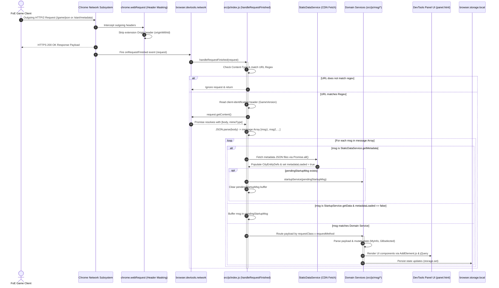
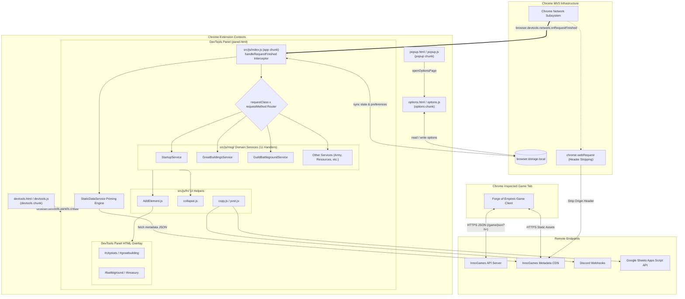

# FoE-Info-Extension System Architecture & Extension Lifecycle Guide

> **Navigation**: [← Documentation Index](INDEX.md) | [Domain Services Reference](domain-services.md) | [Helper Utilities Catalog](helper-utilities.md) | [Granular Codebase Technical Manual](knowledgebase/codebase-technical-manual.md)

## 1. Executive Summary & Architectural Overview

**FoE-Info-Extension** is a Chrome Manifest V3 browser extension designed to capture, parse, analyze, and display real-time player data for the online strategy game _Forge of Empires_ (FoE).

Unlike traditional browser extensions that inject invasive content scripts into the game DOM to scrape HTML elements or hijack JavaScript prototypes, FoE-Info-Extension operates completely **out-of-band** as an observer. It attaches to Chrome's DevTools Network Inspection API (`browser.devtools.network.onRequestFinished`), passively intercepting HTTPS JSON API requests and responses transmitted between the game client (`https://*.forgeofempires.com/game/json?h=`) and InnoGames backend servers, as well as static metadata assets delivered via InnoGames Content Delivery Networks (`https://foe*.innogamescdn.com/start/metadata`).

By decoupling analytical data capture from the active game page, the extension maintains maximum stealth, prevents game client performance degradation, and provides a rich analytical dashboard directly inside a dedicated Chrome Developer Tools panel.

---

## 2. High-Level Chrome Manifest V3 Architecture & Permissions

### 2.1 Context Isolation & Security Boundaries

The extension is partitioned into distinct execution contexts operating under Chrome Manifest V3 security boundaries as declared in `[src/chrome/manifest.json](../src/chrome/manifest.json)` (development environment) and `[src/chrome/manifest_release.json](../src/chrome/manifest_release.json)` (production release):

1. **DevTools Panel Context (`devtools.html` / `panel.html` running `[src/js/index.js](../src/js/index.js)`)**:

   - Spawns a custom Developer Tools panel tab titled `"FoE-Info"` (or `"FoE-Info-DEV"` in development builds).
   - Holds access to the `chrome.devtools.network` API (`browser.devtools.network.onRequestFinished`), allowing out-of-band monitoring of all network traffic in the inspected browser tab.
   - Renders interactive Bootstrap 5 / jQuery dashboards directly inside the DevTools panel frame.

2. **Options Settings Context (`options.html` running `[src/js/options.js](../src/js/options.js)`)**:

   - Executes as an extension options page (`options_ui`).
   - Manages persistent user configuration (feature flags, panel display heights, custom donation ratios, webhook endpoints) in `browser.storage.local`.

3. **Action Popup Context (`popup.html` running `[src/js/popup.js](../src/js/popup.js)`)**:

   - Activated via the extension toolbar action icon.
   - Displays user instructions for launching Chrome Developer Tools (`Ctrl+Shift+I` / `Cmd+Opt+I`) and provides a navigation fallback to `options.html`.

4. **Background Header Modification Context (`chrome.webRequest`)**:
   - Attaches `chrome.webRequest.onBeforeSendHeaders` listeners to sanitize outgoing request headers when fetching static metadata from InnoGames CDNs, stripping extension `Origin` headers to bypass Cross-Origin Resource Sharing (CORS) restrictions.

### 2.2 Permissions Matrix & Specifications

The table below outlines all permissions declared in the extension manifests and their technical rationale:

| Permission                            | Scope / Category | Technical Rationale & Usage                                                                                                                                                                                          |
| ------------------------------------- | ---------------- | -------------------------------------------------------------------------------------------------------------------------------------------------------------------------------------------------------------------- |
| `storage`                             | Permission       | Persists user preferences (`showOptions`), panel sizing (`toolOptions`), cached entity definitions (`CityEntityDefs`), and webhook configurations across browser sessions via `browser.storage.local`.               |
| `unlimitedStorage`                    | Permission       | Removes the current 10 MB `chrome.storage.local` quota, enabling larger local caches; representative peak usage should be measured before retaining this permission.                                                 |
| `clipboardWrite`                      | Permission       | Enables single-click formatted copying of Forge Point (FP) contribution matrices, sector target summaries, and guild statistics directly to the user's OS clipboard via `[src/js/fn/copy.js](../src/js/fn/copy.js)`. |
| `webRequest`                          | Permission       | Grants authority to inspect and modify network request headers via `chrome.webRequest.onBeforeSendHeaders`, specifically stripping `Origin` headers sent to `https://*.innogamescdn.com/*`.                          |
| `https://*.forgeofempires.com/game/*` | Host Permission  | Authorizes out-of-band interception of live game JSON API request/response traffic across all language worlds (e.g., `en1.forgeofempires.com`, `us5.forgeofempires.com`, `de3.forgeofempires.com`).                  |
| `https://*.innogamescdn.com/*`        | Host Permission  | Grants access to download static game entity definitions, building images, unit catalogs, and selection kit metadata tables.                                                                                         |
| `https://discord*.com/api/webhooks/*` | Host Permission  | Permits outbound HTTP POST requests to user-configured Discord webhooks for real-time sector target dispatch and alert logging via `[src/js/fn/post.js](../src/js/fn/post.js)`.                                      |
| `https://*.google.com/*`              | Host Permission  | Permits outbound HTTP POST requests to Google Apps Script Web APIs to synchronize Guild Battleground performance data with Google Sheets.                                                                            |

### 2.3 Content Security Policy (CSP)

Manifest V3 strictly mandates script security. The extension enforces a minimal script policy:

```json
"content_security_policy": {
  "extension_pages": "script-src 'self' ; object-src 'self'"
}
```

Remote code execution, dynamic `eval()`, and inline scripts are forbidden. All executable code is pre-compiled into local JavaScript bundles by Webpack.

---

## 3. Detailed Analysis of Extension Entrypoints

The extension application is composed of four primary JavaScript entry points compiled into separate output bundles by Webpack:

### 3.1 `app`: `[src/js/index.js](../src/js/index.js)` & `[src/chrome/panel.html](../src/chrome/panel.html)`

- **Role**: Central traffic controller, state container, network interceptor, and DevTools panel manager.
- **Initialization Protocol**:
  1. **Global State Instantiation**: Instantiates core runtime memory structures (`CityEntityDefs`, `MilitaryDefs`, `CastleDefs`, `MyInfo`, `PlayerID`, `Resources`, `GBselected`, `hiddenRewards`, `availablePacksFP`).
  2. **Storage Synchronization**: Loads saved options from `browser.storage.local` using `receiveStorage` and registers `browser.storage.onChanged` listener to reactively apply option changes without requiring panel reloads.
  3. **Header Masking Listener**: Attaches `chrome.webRequest.onBeforeSendHeaders` listener to strip extension `Origin` headers on requests matching `https://*.innogamescdn.com/*`.
  4. **DevTools Network Listener**: Attaches `handleRequestFinished(request)` to `browser.devtools.network.onRequestFinished`.
  5. **DOM Container Mounting**: Dynamically mounts dynamic Bootstrap UI containers (`#citystats`, `#greatbuilding`, `#treasury`, `#incidents`, `#battleground`, `#expedition`, `#army`, `#goods`) into `panel.html`.

### 3.2 `devtools`: `[src/js/devtools.js](../src/js/devtools.js)` & `[src/chrome/devtools.html](../src/chrome/devtools.html)`

- **Role**: Lightweight entrypoint for registering the custom panel in Chrome Developer Tools.
- **Execution Flow**:
  - Executed when the user opens Chrome Developer Tools (`F12` or `Ctrl+Shift+I`).
  - Calls `browser.devtools.panels.create(EXT_NAME, null, 'panel.html')`.
  - Spawns a top-level tab titled `"FoE-Info"` (or `"FoE-Info-DEV"` in development) hosting `panel.html`, which loads the main `app` bundle (`[src/js/index.js](../src/js/index.js)`).

### 3.3 `options`: `[src/js/options.js](../src/js/options.js)` & `[src/chrome/options.html](../src/chrome/options.html)`

- **Role**: User configuration and preferences manager.
- **Execution Flow**:
  - Rendered when the user launches extension options (`options_ui`).
  - Executes `restore_options()` on `DOMContentLoaded` to populate HTML checkboxes and input controls from `browser.storage.local`.
  - Binds click handler to `#save` button to trigger `save_options()`, validating inputs (such as capping `donationPercent` at 200%) and updating `browser.storage.local`.
  - Prompts storage permissions using `browser.permissions.request({ permissions: ['storage'] })`.
  - Configures Discord webhook URLs (`url.discordTargetURL`) and Google Sheets API endpoints (`url.sheetGuildURL`).

### 3.4 `popup`: `[src/js/popup.js](../src/js/popup.js)` & `[src/chrome/popup.html](../src/chrome/popup.html)`

- **Role**: Toolbar action popup interface.
- **Execution Flow**:
  - Rendered when clicking the extension badge icon in the Chrome toolbar.
  - Displays user instructions explaining how to open Chrome DevTools to view panel statistics.
  - Binds click listener to `#go-to-options` button to invoke `browser.runtime.openOptionsPage()`, with a fallback to `window.open(browser.runtime.getURL('options.html'))`.

---

## 4. DevTools Network Interception Model (`handleRequestFinished`)

The core engine of FoE-Info-Extension is the `handleRequestFinished(request)` function declared in `[src/js/index.js](../src/js/index.js)` (line 651).

```
   ┌────────────────────────────────────────────────────────────┐
   │ browser.devtools.network.onRequestFinished                 │
   └─────────────────────────────┬──────────────────────────────┘
                                 │ Intercepts request
                                 ▼
   ┌────────────────────────────────────────────────────────────┐
   │ handleRequestFinished(request)                             │
   │ ├─ Check Content-Type & Extract HTTP Headers               │
   │ ├─ Regex Match: /game/json?h= or /start/metadata?id=       │
   │ ├─ Extract 'client-identification' header for GameVersion   │
   │ └─ request.getContent() -> JSON.parse(body)                │
   └─────────────────────────────┬──────────────────────────────┘
                                 │
                 ┌───────────────┴───────────────┐
                 │ Array of Payload Objects      │
                 └───────────────┬───────────────┘
                                 │
        ┌────────────────────────┴────────────────────────┐
        ▼                                                 ▼
┌──────────────────────────────┐          ┌──────────────────────────────┐
│ msg.requestClass ===         │          │ msg.requestClass ===         │
│ 'StaticDataService'          │          │ Domain Service Handler       │
│ (Metadata priming)           │          │ (e.g. GreatBuildingsService) │
└──────────────┬───────────────┘          └──────────────┬───────────────┘
               │                                         │
               ▼                                         ▼
┌──────────────────────────────┐          ┌──────────────────────────────┐
│ fetch(item.url) via          │          │ Check metadataLoaded state:   │
│ Promise.all()                │          │  - If false & StartupService:│
│ -> Populate CityEntityDefs   │          │    buffer in pendingStartupMsg│
│ -> set metadataLoaded = true │          │  - If true: route to service │
│ -> flush pendingStartupMsg   │          │    in src/js/msg/ & update   │
└──────────────────────────────┘          │    shared state & DOM        │
                                          └──────────────────────────────┘
```

### 4.1 Header Masking (`onBeforeSendHeaders`) & CORS Resolution

Before any network request reaches the CDN, `[src/js/index.js](../src/js/index.js)` attaches an `onBeforeSendHeaders` listener targeting `https://*.innogamescdn.com/*`. Using the helper `originWithId(header)`, it checks if an outgoing request includes an `Origin` header containing `chrome-extension://` or `moz-extension://`. If detected, the header is stripped, ensuring CDN asset fetches appear as native browser requests and avoiding Cross-Origin Resource Sharing (CORS) rejection.

### 4.2 Network Interception Listener & Regex URL Filtering

The extension attaches `handleRequestFinished` to `browser.devtools.network.onRequestFinished`. Every HTTP request completed by the inspected tab passes into `handleRequestFinished(request)`.

The function filters requests against two primary regular expressions:

1. Live Game API Packets: `/https:\/\/.*\.forgeofempires\.com\/game\/json\?h=/g`
2. Static CDN Metadata Packets: `/https:\/\/foe.*\.innogamescdn\.com\/start\/metadata\?id=(.*)/g`

Requests failing both regex patterns are immediately ignored.

### 4.3 Asynchronous Content Extraction & Header Inspection

For matching requests, `handleRequestFinished` inspects response headers (`Content-Type` / `content-type`) using `getType()` to confirm JSON or text response formats. It extracts the `client-identification` request header to track active game client version strings (`GameVersion`).

It then calls `request.getContent()`, which returns a Promise resolving to `[body, mimeType]`. The raw JSON string is parsed via `JSON.parse(body)` into an array of response message objects (`[msg1, msg2, ...]`).

### 4.4 Static Metadata Priming (`StaticDataService`) & Deferred Startup Buffer

When a `StaticDataService.getMetadata` message is intercepted (`[src/js/index.js](../src/js/index.js)` lines 719–786), the extension extracts CDN asset URLs (`city_entities`, `military_units`, `selection_kits`, `castle_system`, `boost_types`) and executes parallel `fetch()` calls using `Promise.all()`.

The returned JSON definitions are populated into global dictionaries (`CityEntityDefs`, `MilitaryDefs`, `CastleDefs`, `SelectionKitDefs`, `BoostMetadataDefs`) and stored in `browser.storage.local`. Once complete, the flag `metadataLoaded` is set to `true`.

If a `StartupService.getData` payload arrives before metadata priming completes, processing entity definitions immediately could result in missing entity names or unmapped building stats. To prevent this, the extension buffers the startup payload in `pendingStartupMsg`. As soon as `metadataLoaded` turns `true`, `handleRequestFinished` flushes `pendingStartupMsg`, passing it to `startupService(pendingStartupMsg)`.

### 4.5 Service Router & Domain Message Dispatch Engine

For standard game API packets, `handleRequestFinished` iterates over each message object in the JSON array and matches `msg.requestClass` and `msg.requestMethod` against the service routing table:

- `StartupService` -> Handled by `startupService(msg)`, `emissaryService(msg)`, `boostService(msg)`. Manages city entities, player profile, and emissaries.
- `GreatBuildingsService` -> Handled by `contributeForgePoints(msg)`, `getConstruction(msg)`, `getConstructionRanking(msg)`. Manages GB levels, donor tables, and FP calculations.
- `GuildBattlegroundService` -> Handled by `getBattleground(msg)`, `getState(msg)`, `getBuildings(msg)`, `getLeaderboard(msg)`. Tracks sector attrition, province timers, and leaderboard stats.
- `OtherPlayerService` -> Handled by `otherPlayerService(msg)`, `otherPlayerServiceUpdateActions(msg)`. Processes neighbor/friend city visits, poltimotes, and plunder rewards.
- `ArmyUnitManagementService` -> Handled by `armyUnitManagementService(msg)`. Maintains army unit inventory and health states.
- `BonusService` -> Handled by `getBonuses(msg)`, `getLimitedBonuses(msg)`. Tracks active tavern, emissary, and city stat boosts.
- `CityProductionService` -> Handled by `pickupProduction(msg)`. Tracks building production collection cycles.
- `ClanBattleService` -> Handled by `gvgSummary(msg)`, `getProvinceDetailed(msg)`, `deploySiegeArmy(msg)`. Monitors GvG map sector control and siege deployments.
- `ConversationService` -> Handled by `conversationService(msg)`, `getConversation(msg)`. Manages guild message center threads.
- `GuildExpeditionService` -> Handled by `guildExpeditionService(msg)`. Tracks GE progress and encounter rewards.
- `ResourceService` -> Handled by `getPlayerResources(msg)`, `getResourceDefinitions(msg)`. Tracks player Forge Points, goods inventory, and special resources.

---

## 5. Webpack Bundling Strategy & Asset Pipeline

The extension utilizes Webpack 5 to compile ES modular source code into browser-compatible distribution assets.

### 5.1 Build Configuration Architecture

The repository utilizes a modular Webpack 5 configuration setup split across three dedicated files:

1. `[webpack.common.js](../webpack.common.js)`: Shared base configuration defining entry points (`app`, `options`, `devtools`, `popup`), loader rules (SCSS, JS), automated global injections (`ProvidePlugin`), static file copies (`CopyPlugin`), and vendor code splitting (`splitChunks`).
2. `[webpack.dev.js](../webpack.dev.js)`: Development configuration with source maps (`eval-cheap-module-source-map`), live watch capabilities, and dev server output targeting `build/FoE-Info-DEV/`.
3. `[webpack.prod.js](../webpack.prod.js)`: Production pipeline optimized for AST minification (`TerserPlugin`), CSS minification (`CssMinimizerPlugin`), release packaging (`ZipPlugin`), and optional bundle analysis (`BundleAnalyzerPlugin`) targeting `build/FoE-Info_WEBSTORE/`.

| Feature / Setting                   | `[webpack.dev.js](../webpack.dev.js)` (Development)       | `[webpack.prod.js](../webpack.prod.js)` (Production Webstore)             |
| ----------------------------------- | --------------------------------------------------------- | ------------------------------------------------------------------------- |
| **Build Target Directory**          | `build/FoE-Info-DEV/`                                     | `build/FoE-Info_WEBSTORE/`                                                |
| **Webpack Mode**                    | `'development'`                                           | `'production'`                                                            |
| **Source Maps**                     | `eval-cheap-module-source-map`                            | Disabled                                                                  |
| **Code Minification**               | Disabled                                                  | `TerserPlugin` (ECMA 6 target, mangling enabled)                          |
| **Console Cleaning**                | Retains all `console.*` output                            | Strips `console.info` and `console.debug`                                 |
| **CSS Processing**                  | `style-loader` (Injects `<style>` tags)                   | `MiniCssExtractPlugin` & `CssMinimizerPlugin`                             |
| **Base Manifest Source**            | `[src/chrome/manifest.json](../src/chrome/manifest.json)` | `[src/chrome/manifest_release.json](../src/chrome/manifest_release.json)` |
| **Extension Name (`EXT_NAME`)**     | `"FoE-Info-DEV"`                                          | `"FoE-Info"`                                                              |
| **Global Defines (`DefinePlugin`)** | `DEV: true`, `WEBSTORE: false`                            | `DEV: false`, `WEBSTORE: true`                                            |
| **Archive Packaging**               | Disabled                                                  | `ZipPlugin` generates `FoE-Info_WEBSTORE_<version>_<date>.zip`            |
| **Bundle Analysis**                 | Disabled                                                  | Gated behind `ANALYZE=true` (`npm run analyze`)                           |

### 5.2 Entry Chunks & Asset Mapping

Both configurations define four output entry chunks:

```javascript
entry: {
  app: './src/js/index.js',
  options: './src/js/options.js',
  devtools: './src/js/devtools.js',
  popup: './src/js/popup.js'
}
```

### 5.3 Automated Global Injection (`webpack.ProvidePlugin`)

To streamline module development and avoid repetitive imports across files, Webpack automatically provisions global variables:

```javascript
new webpack.ProvidePlugin({
  $: 'jquery',
  jQuery: 'jquery',
  browser: 'webextension-polyfill',
});
```

This guarantees that jQuery (`$`, `jQuery`) and the webextension API polyfill (`browser`) are universally available across all bundled modules.

### 5.4 Production Minification & Console Stripping (`TerserPlugin`)

In `[webpack.prod.js](../webpack.prod.js)`, `TerserPlugin` performs AST transformations to minify code and strip non-essential debug logging:

```javascript
new TerserPlugin({
  terserOptions: {
    ecma: 6,
    compress: {
      pure_funcs: ['console.info', 'console.debug'],
    },
    format: {
      comments: false,
    },
    mangle: true,
    module: true,
  },
  extractComments: false,
});
```

### 5.5 Asset Extraction, Manifest Synthesis & Automated Zip Packaging

1. **`MiniCssExtractPlugin`**: Compiles SCSS stylesheets (`[src/css/main.scss](../src/css/main.scss)`, `[src/css/options.scss](../src/css/options.scss)`) into standalone CSS files (`app.css`, `options.css`).
2. **`HtmlWebpackPlugin`**: Injects compiled bundle tags into HTML templates (`panel.html`, `options.html`, `popup.html`, `devtools.html`).
3. **`WebpackExtensionManifestPlugin`**: Reads `[src/chrome/manifest_release.json](../src/chrome/manifest_release.json)`, injects version metadata from `package.json`, and writes `manifest.json` into the build directory.
4. **`ZipPlugin`**: Compresses the build output directory into a production Webstore distribution ZIP archive (`FoE-Info_WEBSTORE_<version>_<YYYY-MM-DD>.zip`) located in `build/`.

---

## 6. Global Event Loop Lifecycle & State Mutation Architecture

### 6.1 Step-by-Step Global Event Loop Sequence

The operational lifecycle of FoE-Info-Extension follows a reactive, event-driven loop from browser launch to DOM rendering:

```
[ In-Game Player Action ] (e.g., Collect City Production / Open GB / Fight in GBG)
           │
           ▼
[ FoE Client HTTPS Request ] ──> [ InnoGames Backend Server ]
                                             │
                                             ▼ [ HTTPS Response JSON ]
                                  [ Chrome Network Subsystem ]
                                             │
                                             ▼ onRequestFinished Event
                                  [ src/js/index.js ]
                                  handleRequestFinished(request)
                                             │
                                             ▼ request.getContent()
                                  [ JSON Array Parsing ]
                                             │
                       ┌─────────────────────┴─────────────────────┐
                       ▼                                           ▼
             [ Static Metadata ]                         [ Game API Packet ]
            StaticDataService.getMetadata             Match requestClass x requestMethod
                       │                                           │
                       ▼                                           ▼
             Fetch CDN JSON Files                       Dispatch to Domain Service
            Populate CityEntityDefs                    (e.g., GreatBuildingsService)
                       │                                           │
                       └─────────────────────┬─────────────────────┘
                                             │
                                             ▼ State Mutation
                                  [ Runtime Memory State ]
                                  (MyInfo, GBselected, Resources, etc.)
                                             │
                                             ▼ UI Rendering
                                  [ src/js/fn/ Helper Catalog ]
                                  AddElement.js / helper.js / copy.js
                                             │
                                             ▼ DOM Mounting
                                  [ DevTools Panel UI Frame ]
                                  (#citystats, #greatbuilding, #battleground)
                                             │
                                             ▼ Storage & Webhook Sync
                                  [ browser.storage.local ] & [ post.js Discord/Sheets ]
```

1. **Trigger**: Player performs an in-game action (e.g., collects production, visits neighbor, fights in GBG).
2. **Network Event**: Chrome network layer receives response payload from InnoGames servers and triggers `browser.devtools.network.onRequestFinished`.
3. **Interception**: `handleRequestFinished(request)` filters request URL, extracts HTTP headers, and invokes `request.getContent()`.
4. **Parsing**: Body JSON string is parsed into an array of message objects (`msg`).
5. **Metadata Sync / Deferral**: If metadata packet, downloads entity definitions via `Promise.all()` and sets `metadataLoaded = true`. If domain packet and metadata is not yet loaded, buffers message in `pendingStartupMsg`.
6. **Domain Dispatch**: Matches `msg.requestClass` and `msg.requestMethod` against domain handlers in `src/js/msg/`.
7. **State Mutation**: Domain service mutates shared state variables (`MyInfo`, `GBselected`, `Resources`, `hiddenRewards`, `availablePacksFP`).
8. **UI Rendering & DOM Mount**: Domain service invokes DOM construction helpers from `[src/js/fn/AddElement.js](../src/js/fn/AddElement.js)` and `[src/js/fn/collapse.js](../src/js/fn/collapse.js)`, updating container elements inside `panel.html`.
9. **Persistence & Webhook**: Updates are saved to `browser.storage.local` via `[src/js/fn/storage.js](../src/js/fn/storage.js)`, and external target alerts are posted to Discord/Google Sheets via `[src/js/fn/post.js](../src/js/fn/post.js)`.

### 6.2 State Persistence & Reactive Storage Synchronization

The extension uses `browser.storage.local` for persistence:

- **Options Sync**: Changing settings on `options.html` writes updated `showOptions` objects to storage. The `storageChange` listener in `[src/js/index.js](../src/js/index.js)` captures the storage event and updates runtime flags instantly.
- **Cache Persistence**: Static metadata (`CityEntityDefs`) and historical logs are stored locally to allow instant restoration upon panel initialization without requiring full CDN re-downloads.

---

## 7. Architecture Sequence & Component Diagrams

### 7.1 Sequence Diagram 1: DevTools Network Interception Lifecycle

The sequence diagram below illustrates the end-to-end lifecycle of a network request intercepted from the inspected game tab:



### 7.2 Diagram 2: Chrome Extension Entrypoint & Component Lifecycle

The flowchart below illustrates component interactions across Manifest V3 entry points, Webpack bundles, extension storage, and external endpoints:



---

## 8. Build Verification & Maintenance Protocol

To verify the integrity of the architecture implementation and ensure Webpack bundles compile without errors, run the build verification command:

```bash
npm run build
```

### Verification Criteria Checklist:

1. **Compilation Output**: Webpack completes with exit code `0` and builds into `build/FoE-Info_WEBSTORE/`.
2. **Bundle Verification**: Confirms presence of all 4 entry chunks: `app.js`, `devtools.js`, `options.js`, `popup.js`, along with `app.css` and `options.css`.
3. **Manifest Synthesis**: Verifies `manifest.json` in the build output contains Manifest V3 fields and matching permissions (`storage`, `unlimitedStorage`, `clipboardWrite`, `webRequest`).
4. **Archive Packaging**: Confirms `ZipPlugin` generates a compressed distribution ZIP archive (`build/FoE-Info_WEBSTORE_<version>_<date>.zip`).
5. **Documentation Link Integrity**: All source code links in this document use relative paths to `../src/` and point directly to valid files.
