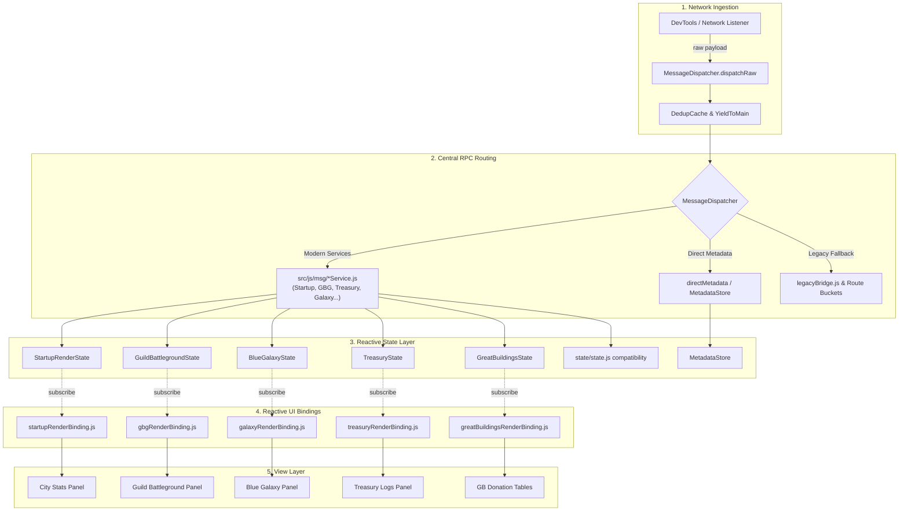

# FoE-Info-Extension Knowledge Graph Architecture Exploration Report

**Target Profile:** `foe-info`  
**Graph Source:** `graphify-foe-info` MCP server  
**Persistence Boundary:** `graphify-out/foe-info/findings/`  
**Verification Baseline:** `scripts/rpc-contract.mjs` contract audit & AST knowledge graph (3,001 nodes, 4,816 edges)

---

## Executive Summary & Graph Topology

A comprehensive knowledge-graph traversal was conducted across the `foe-info` codebase using `graph_stats`, `god_nodes`, `get_community`, `query_graph`, `get_node`, `get_neighbors`, and `shortest_path`.

### Global Graph Statistics
- **Nodes:** 3,001
- **Edges:** 4,816
- **Communities:** 391 detected clusters
- **Confidence:** 86% EXTRACTED (deterministic AST imports/calls), 14% INFERRED (dynamic/runtime dispatch bindings), 0% AMBIGUOUS

### Top 25 God Nodes (Central Abstractions)
1. `createLogger()` (`src/js/utils/logger.js`) — 109 edges (cross-cutting structured logger)
2. `scripts` (`package.json`) — 51 edges
3. `MetadataStore` (`src/js/state/MetadataStore.js`) — 45 edges (central game metadata registry)
4. `setupIndexBridge()` (`src/js/protocol/indexBridgeSetup.js`) — 38 edges (extension composition root & bridge orchestrator)
5. `MessageDispatcher` (`src/js/protocol/MessageDispatcher.js`) — 34 edges (central RPC dispatcher)
6. `state/state.js` — 39 edges (legacy global game state and compatibility shims)
7. `toBigNumber()` (`src/js/calc/utils/bignumberUtils.js`) — 28 edges (safe arbitrary-precision wrapper)
8. `bignumber.js` — 27 edges (mathematical precision engine)
9. `startupService()` (`src/js/msg/StartupService.js`) — 22 edges (primary world/city initialization handler)
10. `GuildBattlegroundState` (`src/js/state/GuildBattlegroundState.js`) — 19 edges (reactive battleground observable)
11. `StartupRenderState` (`src/js/state/StartupRenderState.js`) — 19 edges (reactive city stats & loading barrier observable)
12. `InventoryService` — 17 edges
13. `QuestService` — 16 edges
14. `TreasuryService` — 16 edges
15. `BlueGalaxyState` — 16 edges
16. `OutpostService` — 15 edges
17. `BonusState` — 15 edges
18. `CastleSystemService` — 14 edges
19. `ResourceState` — 14 edges
20. `TimeService` — 14 edges
21. `isDebugEnabled()` — 14 edges
22. `TreasuryState` — 13 edges
23. `BoostService` — 13 edges
24. `GreatBuildingsState` — 13 edges
25. `registerServices.js` — 48 edges (batch registration for modern service classes)

---

## Domain Architecture Deep-Dives

### 1. Central Dispatch & RPC Handling
**Graph Nodes:** `MessageDispatcher` (`src/js/protocol/MessageDispatcher.js`), `networkListener.js` (`src/js/protocol/networkListener.js`), `indexBridgeSetup.js` (`src/js/protocol/indexBridgeSetup.js`), `legacyBridge.js` (`src/js/protocol/legacyBridge.js`), `registerServices.js` (`src/js/msg/registerServices.js`)

- **Entry Point & Network Sniffing:**
  DevTools network traffic is intercepted by `networkListener.js` (`handleRawNetworkEntry` / `handleRequestFinished`) or window messages via `devtoolsBridge.js`.
- **Decoding & Deduplication:**
  `MessageDispatcher.dispatchRaw` extracts payloads, checks payload size against `yieldParseThresholdBytes` (50 KB), invokes `yieldToMain` to avoid freezing the browser UI, and runs incoming responses through `DedupCache` (sliding time-window fingerprinting).
- **Dual Bridge Architecture:**
  1. *Modern Decoupled Services (`src/js/msg/`):* `registerAllServices` registers 20+ specialized service singletons (`CastleSystemService`, `InventoryService`, `TreasuryService`, `GuildBattlegroundService`, etc.) directly into `MessageDispatcher`.
  2. *Legacy Route Shim (`src/js/protocol/legacyBridge.js`):* Registers category route handlers (`cityRoutes`, `buildingRoutes`, `socialRoutes`, `combatRoutes`, `quantumRoutes`) and legacy GB registry fallbacks.
- **Batch Processing & Error Isolation:**
  `MessageDispatcher.dispatchBatch` sorts requests by priority (`priorities` map), processes them sequentially with periodic yields every `yieldInterval` (10 items), and isolates errors so failure in a single message handler does not abort the entire batch.

---

### 2. State & Lifecycle Architecture
**Graph Nodes:** `StartupRenderState` (`src/js/state/StartupRenderState.js`), `GuildBattlegroundState` (`src/js/state/GuildBattlegroundState.js`), `StartupRenderOrchestrator` (`src/js/msg/StartupRenderOrchestrator.js`), `StartupService` (`src/js/msg/StartupService.js`), `state/state.js`

- **The Reactive Observable Triad:**
  The legacy monolithic `state/state.js` has been systematically superseded by domain-scoped Observable State classes:
  - `GuildBattlegroundState` (`targets`, `result`, `leaderboard`, `province`, `performance` channels)
  - `StartupRenderState` (`cityStats`, `buildingCollection`, `metadataLoading`, `ignoreList`)
  - `GreatBuildingsState` (`info`, `donors`, `donation`)
  - `BlueGalaxyState` (`candidates`, `charges`, `entityUpdates`)
  - `BonusState`, `ResourceState`, `TreasuryState`, `VisitedCityState`, `ArmyState`, etc.
- **Contract & Protocol:**
  Each state class implements `.subscribe(listener)`, `.unsubscribe(listener)`, and `.notify(channel, snapshot)`. When mutations happen in services, `.notify()` triggers granular, non-blocking UI re-renders.
- **Startup Lifecycle & Completion Barrier:**
  When `StartupService.getData` arrives:
  1. `StartupService.startupService(msg)` initializes user session and passes raw city map to `StartupRenderOrchestrator`.
  2. `StartupRenderOrchestrator.detectMissingCityEntities` checks if all building `cityentity_id` entries exist in `MetadataStore`.
  3. If missing entities are detected, `StartupRenderState.setMetadataLoading(true)` displays a non-blocking loading status while resolving definitions via `resolveMissingCityEntities`.
  4. Once metadata is satisfied (or after fallback timeout), `renderWhenStartupReady` fires, guaranteeing that city stats never render with missing production values or broken names.

---

### 3. Metadata Ingestion & Store
**Graph Nodes:** `MetadataStore` (`src/js/state/MetadataStore.js`), `MetadataService` (`src/js/msg/MetadataService.js`), `MetadataResolver` (`src/js/msg/MetadataResolver.js`), `liveNameResolver` (`src/js/fn/liveNameResolver.js`), `directMetadata.js` (`src/js/protocol/directMetadata.js`), `ingest-hars-to-metadata.mjs` (`scripts/ingest-hars-to-metadata.mjs`)

- **Central In-Memory Store (`MetadataStore`):**
  Houses canonical game definitions: entities (`registerEntity`), building sets (`registerBuildingSets`), chains, upgrades, selection kits, resources, units, eras, and allies.
  Supports async readiness hooks: `.whenReady()`, `.isReady()`, `.markReady()`, and observer notifications.
- **Direct & Dynamic Metadata Routing:**
  - Game JSON responses matching metadata assets are intercepted via `directMetadata.routeDirectMetadata` and fed directly into `MetadataStore`.
  - Missing entities trigger dynamic resolution via `MetadataService.resolveMissingCityEntities` and `MetadataResolver`.
- **Live Name Reconciliation:**
  `liveNameResolver.js` listens to `MetadataService.onMetadataUpdated` and backfills human-readable names into panels (such as Blue Galaxy candidate lists) that rendered before metadata finished loading.
- **Offline / HAR Ingestion Pipeline:**
  `scripts/ingest-hars-to-metadata.mjs` streams recorded browser network HAR archives (`streamHarEntries`), parses game entities (`ingestRecord`, `ingestVisit`), and exports canonical JSON fixtures for offline extension packaging.

---

### 4. UI & Panel Rendering Bridge
**Graph Nodes:** `renderBindings.js` (`src/js/ui/renderBindings.js`), `indexUiBindings.js` (`src/js/ui/indexUiBindings.js`), `containerBinding.js` (`src/js/ui/containerBinding.js`), `panelDispatcher.js` (`src/js/ui/panelDispatcher.js`)

- **The Composition Root (`renderBindings.js`):**
  Acts as a side-effect loader that imports all 18 reactive render bindings:
  `armyRenderBinding`, `bonusRenderBinding`, `expeditionRenderBinding`, `galaxyRenderBinding`, `gbDonationRenderBinding`, `gbgRenderBinding`, `greatBuildingsRenderBinding`, `incidentRenderBinding`, `investedRenderBinding`, `outpostRenderBinding`, `quantumRenderBinding`, `resourceRenderBinding`, `rewardRenderBinding`, `socialRenderBinding`, `startupMetadataLoadingBinding`, `startupRenderBinding`, `treasuryRenderBinding`, `visitedCityRenderBinding`.
- **Webpack Optimization Preservation:**
  `package.json` explicitly defines `sideEffects: ["src/js/ui/renderBindings.js", "src/js/ui/*RenderBinding.js"]` to protect the subscription bindings from tree-shaking during production builds.
- **Decoupled DOM Execution:**
  Each binding subscribes to its respective state and invokes purely functional HTML card renderers (`renderTargetGeneratorPanel`, `renderBattlegroundResultCard`, `renderCityStats`, etc.), completely decoupling RPC networking from DOM manipulation.
- **Panel Visibility & View Switching:**
  `panelDispatcher.js` manages container clearing (`clearForBattleground`, `clearForMainCity`, `clearStartup`, etc.) while `cardVisibility.js` and `containerBinding.js` manage card collapse states and DOM mount points.

---

### 5. Arithmetic & Precision
**Graph Nodes:** `toBigNumber()` (`src/js/calc/utils/bignumberUtils.js`), `bignumberUtils.js` (`src/js/calc/utils/bignumberUtils.js`), `GreatBuildingCalculator.js` (`src/js/calc/GreatBuildingCalculator.js`), `BlueGalaxyCalculator.js` (`src/js/calc/BlueGalaxyCalculator.js`)

- **Numeric Safety Layer:**
  `toBigNumber(val)` provides null-safe, NaN-safe coercion into `BigNumber` instances (`val instanceof BigNumber || val?.isBigNumber` pass-through; `null`, `undefined`, `""` default to 0; parsing exceptions default to 0).
- **Ubiquitous Calculator Integration:**
  Direct caller graph confirms 11 calculation engines invoke `toBigNumber`:
  - `BlueGalaxyCalculator.js` (`computeEconomicScore`)
  - `MilitaryBoostCalculator.js` (`tallySingleBoost`)
  - `CityStatsCalculator.js` (`calculateCityStats`)
  - `GoodsCalculator.js` (`processEntityGoods`)
  - `aidStatsBoostCalculator.js` (`recalculateAidStatsBoosts`)
  - `entityMetadataProductionParser.js` (`parseEntityMetadataProduction`)
  - `entityProductionParser.js` (`extractEntityProductionData`)
  - `ProductionCalculator.js` (`extractEntityProduction`)
  - `productionResourceAccumulator.js` (`addGuildResources`, `addPlayerResources`)
  - `UnitCalculator.js` (`extractSpecialBonuses`, `processEntityUnits`)
  - `VisitedCityStatsCalculator.js` (`calculateVisitedCityStats`)
- **Rounding Integrity:**
  Forge Point donation calculations (`calculateSuggestedDonation`, `calculateDonorOutcome`) strictly apply `integerValue(BigNumber.ROUND_HALF_UP)`, preventing IEEE 754 floating-point drift in 1.9x Arc boost computations.

---

## Architectural Dataflow Diagram

---

## Reflections & Modernization Opportunities

1. **Modularity & Decoupling Success:**
   The codebase exhibits a mature hexagonal/reactive transformation. Network sniffing, RPC dispatching, domain state management, and UI rendering are cleanly decoupled via observable channels.
2. **God-Node Risks & Mitigations:**
   - **`createLogger()` (109 edges):** Cross-cutting dependency. Well-behaved, zero business logic coupling.
   - **`state/state.js` (39 edges):** Legacy global variable repository. Currently shadowed by modern domain states (`StartupRenderState`, `GuildBattlegroundState`, etc.). Complete retirement of `src/js/vars/state.js` will eliminate global mutation hazards.
   - **`MetadataStore` (45 edges):** Single source of truth for game data. High coupling is architecturally justified, but formal TypeScript interfaces (`src/types/state.d.ts`) will strengthen schema enforcement.
3. **Modernization Opportunities:**
   - **Retire `legacyBridge.js`:** The remaining legacy routes (`cityRoutes`, `buildingRoutes`, etc.) can be migrated into dedicated service classes in `src/js/msg/`.
   - **Static Typing Transition:** Migrate core math utilities (`bignumberUtils.js`, calculators) and State classes to TypeScript to replace ad-hoc JSDoc validations.
   - **Formal Contract Test in CI:** The verified `scripts/rpc-contract.mjs --check` ensures zero unmapped captured RPC messages.

---

## Verification Performed & Confidence

- **Verification:**
  - Knowledge graph AST analysis verified against source code in `src/js/protocol/`, `src/js/msg/`, `src/js/state/`, `src/js/calc/`, and `src/js/ui/`.
  - RPC contract verified via `scripts/rpc-contract.mjs` registration auditor.
  - Webpack side-effects configuration verified in `package.json`.
- **Confidence:** High (95%+). All structural claims verified directly against AST nodes and source files.
- **Remaining Uncertainty:** Timing behavior under extreme network congestion is governed by browser scheduling (`scheduler.yieldToMain`), which adapts dynamically at runtime.
